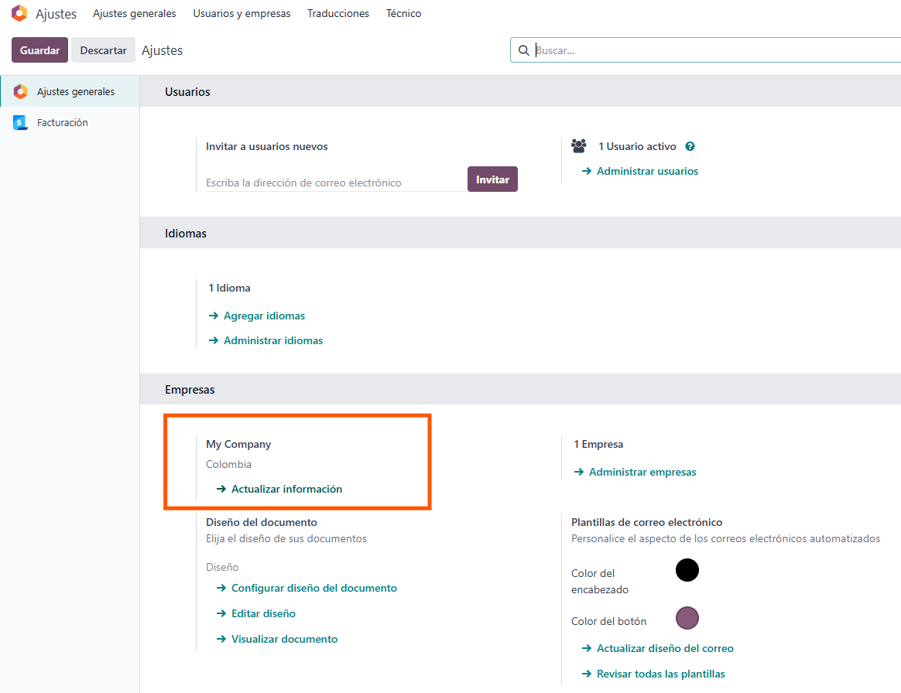
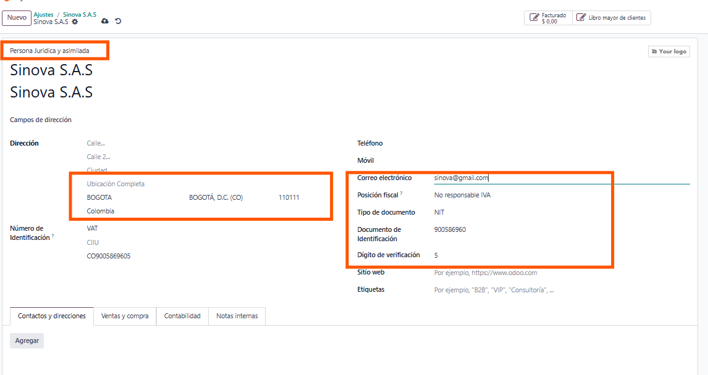
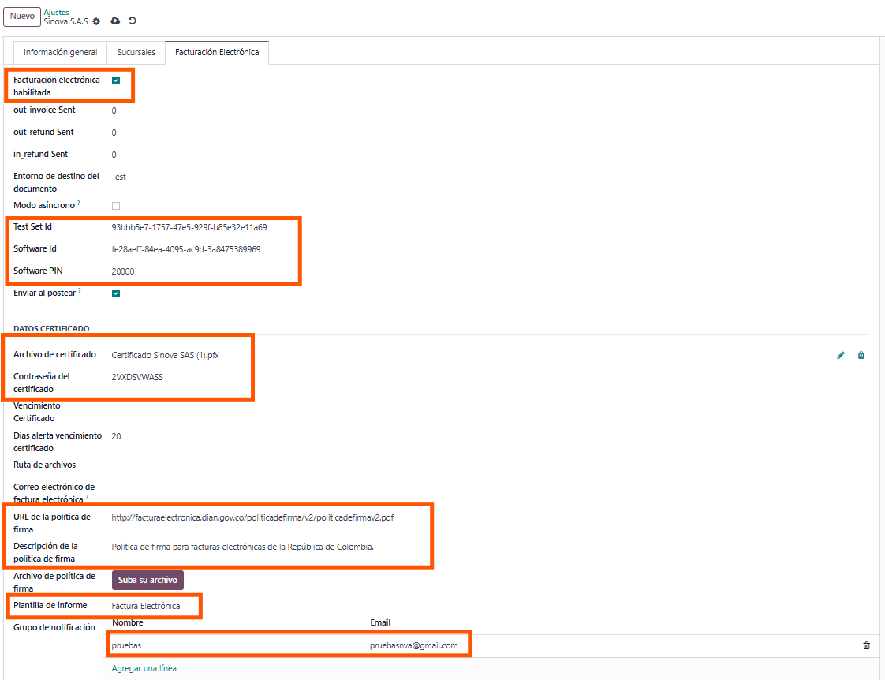

Ir a la configuración de la empresa

Rellenar la información de ciudadP

Ir al contacto relacionado

Rellenar la información

Ir a la pestaña de facturación electrónica y rellenar la información (Todos los marcados en rojo)
