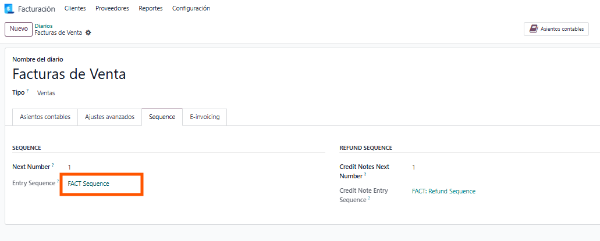
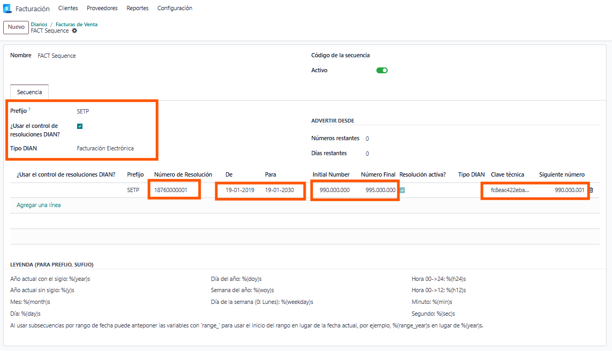

Crea uno nuevo si no existe (importante marcar el check de facturación electronica)

Ahora en la pestaña de secuencia da click sobre el registro de Entry Sequence

En el registro que se abre configurar los datos con el set de pruebas proporcionado
