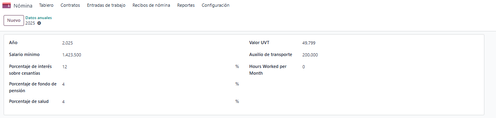

## 1. Datos Anuales (hr.annual.data)
Ubicación: Nómina → Configuración → Datos anuales

Configuración requerida:

- Año: Año fiscal actual (ej: 2025)
- Salario mínimo: Valor del salario mínimo legal vigente
- Valor UVT: Unidad de Valor Tributario del año actual
- Auxilio de transporte: Valor del auxilio de transporte legal

Validaciones:
- Solo puede existir un registro por año
- Todos los valores deben ser mayores a cero
- Es obligatorio tener el registro del año actual