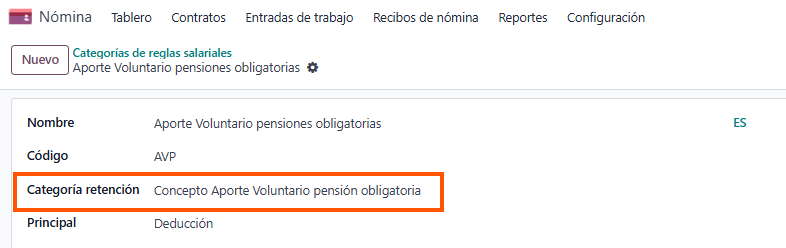

Ubicación: Nómina → Configuración → Categorías de Reglas

Configuración automática: El sistema crea automáticamente las siguientes categorías:

### 5.1 Categorías Principales
- TotRet: Totales Retención
- SSC: Seguridad Social
- AFC: Aportes Fondos Cesantías

### 5.2 Vinculación con Categorías de Retención
- Cada categoría salarial debe estar vinculada a su categoría de retención correspondiente
- Restricción: No se puede asignar categoría de retención a categorías padre

